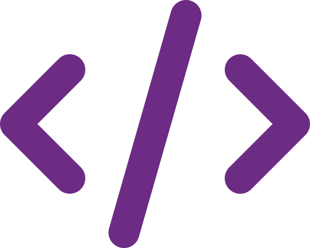

<section style="display:flex;flex-direction:column;align-items:center;gap:1.2rem;">
  

    <h3>
      <samp>
        &gt; Hello There! I am
        <a target="_blank" href="https://joaoborba.com">Borba</a>
        👋
      </samp>
    </h3>
    

      <samp>
        「 Web|.NET Developer from <b>Brazil</b> 」
      </samp>
    

  

  

    

      

        💜 I love coding and learning new things
      

      

        
        <a style="font-weight:bold;" target="_blank" href="https://joaoborba.com">
          joaoborba.com
        </a>
      

    

    

      
    

  

</section>
<section style="margin:5rem 0;">
  <h2>
    Favorite Technologies 👨🏼‍💻
  </h2> 
  

    

      <h3>Front-End</h3>
      
      
      
      
      
      
    

    

      <h3>Back-End</h3>
      
      
      
      
    

  

</section>
<section style="display:flex;flex-direction:column;gap:1rem;" class="d-flex flex-column gap-1">
  

    <h2 style="display:flex;gap:0.5rem;" class="d-flex gap-1over2">
      Statistics
      
    </h2>
  

  
  
</section>
